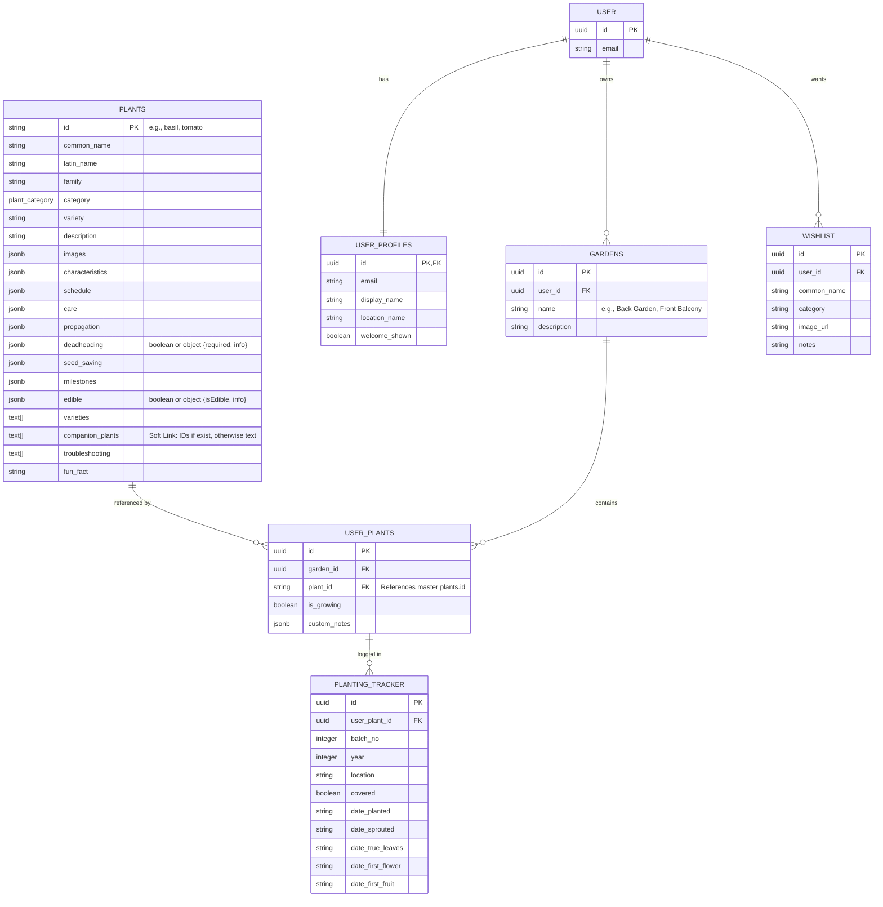

# Plant Database ERD & Hierarchy

This document illustrates the structure of the project, including the botanical classification and the hierarchical user model.

## User & Garden Hierarchy

This diagram shows the relationship between users, their gardens, and the shared plant database.

## Hierarchy Levels

1.  **System Level (Shared)**: The `plants` table contains the master encyclopedic data. It is read-only for users.
2.  **User Level (Identity)**: Managed by Supabase Auth (`USER`) and extended via the `USER_PROFILES` table for app-specific settings.
3.  **Garden Level (Container)**: The `GARDENS` table allows a single user to manage multiple independent physical spaces.
4.  **Instance Level (Specifics)**: `USER_PLANTS` links a master plant to a specific garden. This is where per-garden state (like "is currently growing") lives.
5.  **Log Level (Activity)**: `PLANTING_TRACKER` stores historical and active growth data for a specific plant instance.

---

## Plant Classification (Botanical Structure)

This diagram illustrates the structure of plant categories and families.

```mermaid
graph TD
    %% Root Node
    Garden[My Plant DB]

    %% Main Categories
    Garden --> Vegetables[Vegetables & Fruit]
    Garden --> Herbs[Herbs]
    Garden --> Flowers[Flowers]

    %% Vegetables Grouping
    subgraph Vegetables_Sub [Vegetable & Fruit Families]
        Vegetables --> Solanaceae[Solanaceae]
        Vegetables --> Brassicaceae[Brassicaceae]
        Vegetables --> Cucurbitaceae[Cucurbitaceae]
        Vegetables --> Asteraceae_Veg[Asteraceae]
        Vegetables --> Fabaceae_Veg[Fabaceae]
        Vegetables --> Rosaceae_Fruit[Rosaceae]
        Vegetables --> Amaranthaceae[Amaranthaceae]
        Vegetables --> Poaceae[Poaceae]
    end

    %% Herbs Grouping
    subgraph Herbs_Sub [Herb Families]
        Herbs --> Lamiaceae_Herb[Lamiaceae]
        Herbs --> Apiaceae[Apiaceae]
        Herbs --> Amaryllidaceae[Amaryllidaceae]
        Herbs --> Brassicaceae_Herb[Brassicaceae]
    end

    %% Flowers Grouping
    subgraph Flowers_Sub [Flower Families]
        Flowers --> Asteraceae_Flow[Asteraceae]
        Flowers --> Plantaginaceae[Plantaginaceae]
        Flowers --> Tropaeolaceae[Tropaeolaceae]
        Flowers --> Brassicaceae_Flow[Brassicaceae]
        Flowers --> Caryophyllaceae[Caryophyllaceae]
        Flowers --> Ranunculaceae[Ranunculaceae]
        Flowers --> Malvaceae[Malvaceae]
        Flowers --> Violaceae[Violaceae]
    end

    %% Plants - Solanaceae
    Solanaceae --> TT_Red[Tumbling Tom Red]
    Solanaceae --> TT_Yellow[Tumbling Tom Yellow]

    %% Plants - Brassicaceae
    Brassicaceae --> Radish[Radish]
    Brassicaceae_Veg --> Spinach_Note[Spinach - categorized here for ease]
    Brassicaceae_Herb --> Rocket[Rocket]
    Brassicaceae_Flow --> Matthiola[Matthiola]

    %% Plants - Cucurbitaceae
    Cucurbitaceae --> Courgette[Courgette]

    %% Plants - Asteraceae
    Asteraceae_Veg --> Lettuce[Lettuce]
    Asteraceae_Flow --> Marigold[Marigold]
    Asteraceae_Flow --> Calendula[Calendula]
    Asteraceae_Flow --> Cosmos[Cosmos]
    Asteraceae_Flow --> Sunflower[Sunflower]

    %% Plants - Fabaceae
    Fabaceae_Veg --> BroadBeans[Broad Beans]
    Fabaceae_Veg --> ClimbingBeans[Climbing Beans]

    %% Plants - Rosaceae
    Rosaceae_Fruit --> Strawberry[Strawberry]
    Rosaceae_Fruit --> Raspberry[Raspberry]

    %% Plants - Amaranthaceae
    Amaranthaceae --> Spinach[Spinach 'Apollo' F1]

    %% Plants - Poaceae
    Poaceae --> Sweetcorn[Sweetcorn]

    %% Plants - Lamiaceae
    Lamiaceae_Herb --> Basil[Basil]
    Lamiaceae_Herb --> Mint[Mint]
    Lamiaceae_Herb --> Lavender[Lavender]

    %% Plants - Apiaceae
    Apiaceae --> Coriander[Coriander]
    Apiaceae --> Parsley[Parsley]

    %% Plants - Amaryllidaceae
    Amaryllidaceae --> Chives[Chives]

    %% Plants - Others
    Plantaginaceae --> Snapdragon[Snapdragon]
    Tropaeolaceae --> Nasturtium[Nasturtium]
    Caryophyllaceae --> Carnation[Carnation Pinks]
    Ranunculaceae --> Hellebore[Hellebore]
    Malvaceae --> Hollyhock[Hollyhock]
    Violaceae --> Pansy[Pansy]

    %% Styling
    classDef category fill:#2d6a4f,stroke:#fff,color:#fff,font-weight:bold;
    classDef family fill:#52b788,stroke:#2d6a4f,color:#000;
    classDef plant fill:#d8f3dc,stroke:#2d6a4f,color:#000;

    class Vegetables,Herbs,Flowers category;
    class Solanaceae,Brassicaceae,Cucurbitaceae,Asteraceae_Veg,Lamiaceae_Herb,Apiaceae,Amaryllidaceae,Brassicaceae_Herb,Asteraceae_Flow,Plantaginaceae,Tropaeolaceae,Caryophyllaceae,Fabaceae_Veg,Rosaceae_Fruit,Amaranthaceae,Poaceae,Ranunculaceae,Malvaceae,Violaceae family;
    class TT_Red,TT_Yellow,Radish,Rocket,Courgette,Lettuce,Marigold,Basil,Mint,Lavender,Coriander,Chives,Snapdragon,Nasturtium,Carnation,Parsley,Raspberry,Spinach,Hellebore,Hollyhock,Matthiola,Pansy,Strawberry,Sunflower,Sweetcorn,Calendula,Cosmos,BroadBeans,ClimbingBeans plant;
```

## Data Structure (JSON)

Each plant is defined in its own JSON file with the following relevant fields:

| Field | Description | Example |
| :--- | :--- | :--- |
| `category` | High-level grouping (herb, vegetable, flower, or fruit) used for filtering in the UI. | `herb`, `vegetable`, `flower`, `fruit` |
| `family` | Botanical family (used here as a subcategory). | `Lamiaceae`, `Solanaceae` |
| `id` | Unique slug/identifier for the plant. | `basil` |
| `commonName`| User-friendly name. | `Basil` |
| `edible` | Describes if the plant/flower is edible. | `true` or `{ "isEdible": true, "info": "..." }` |
